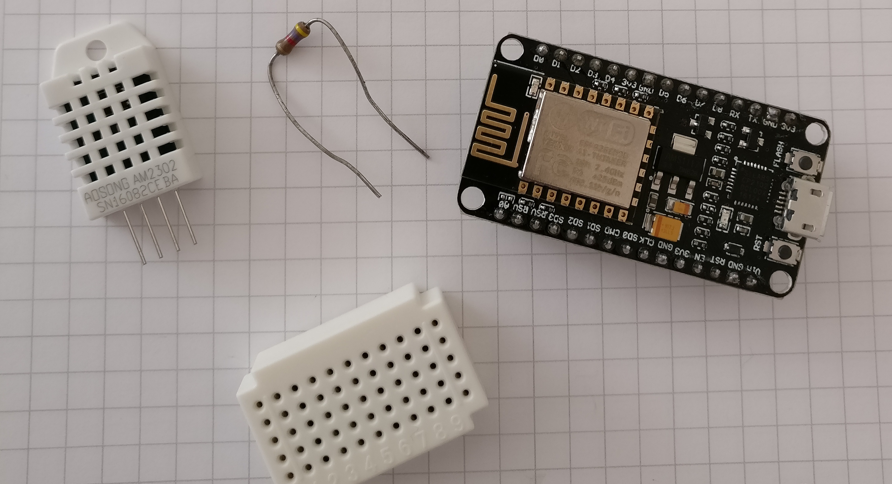
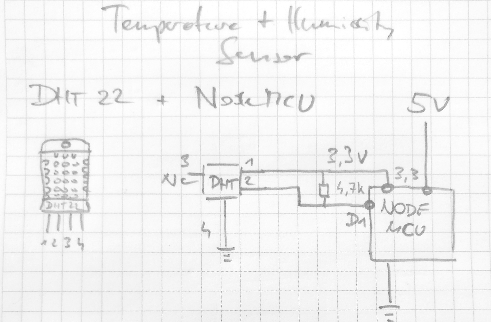
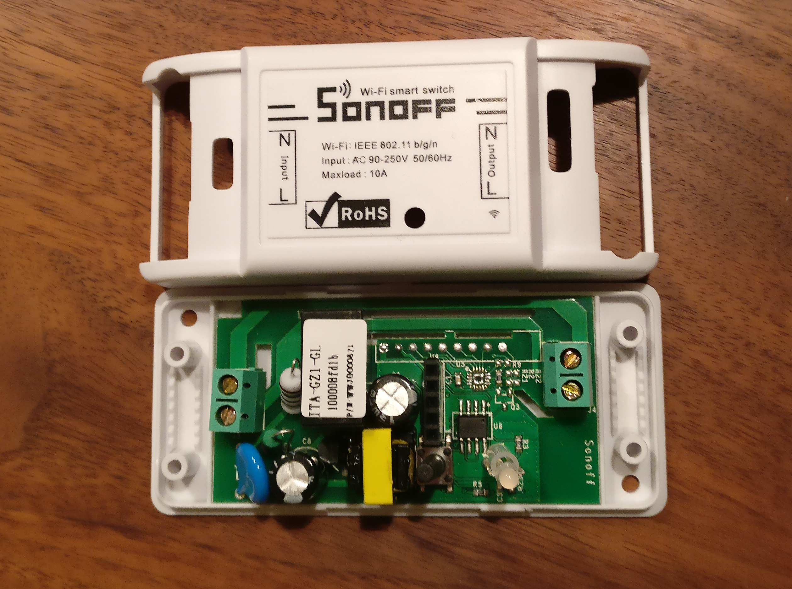
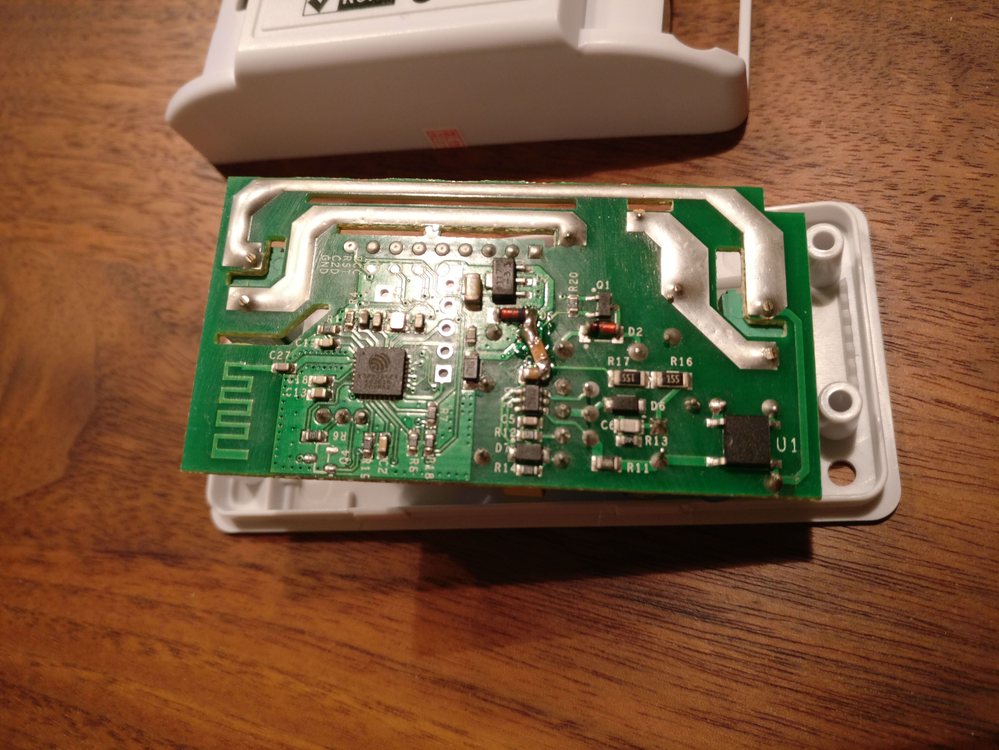
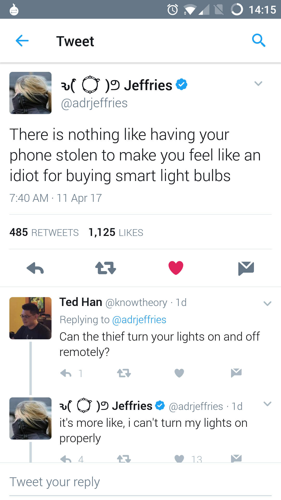
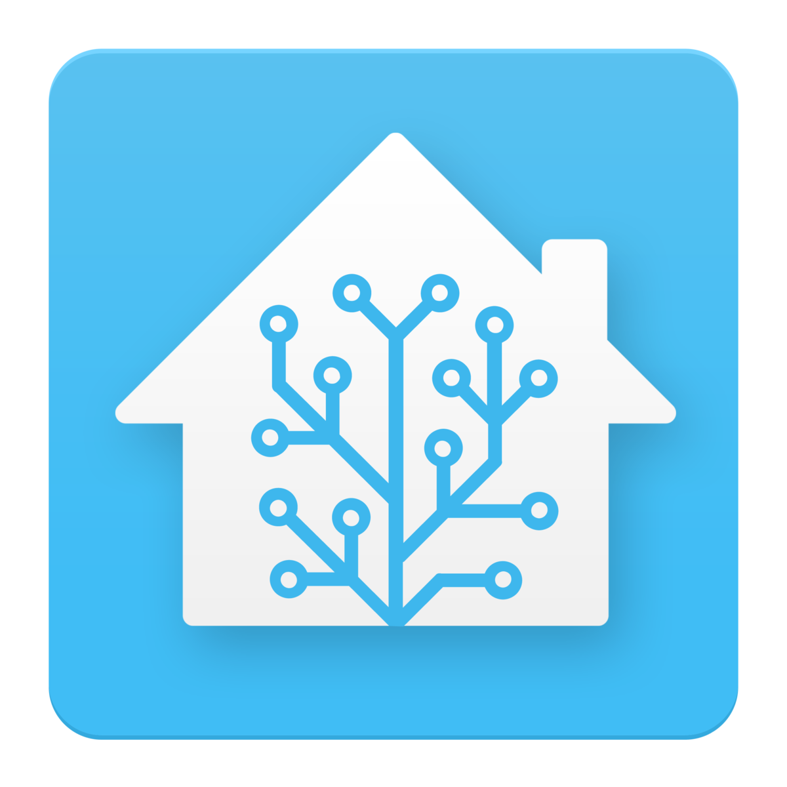
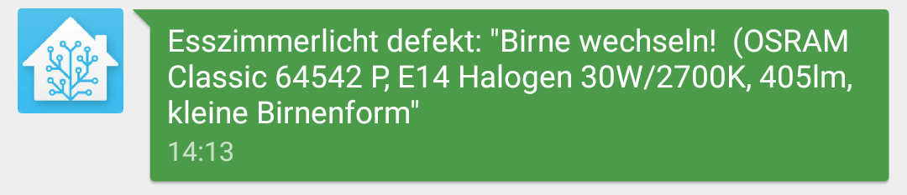

# Home Automation with Python
### ... how to rule your home with Python


## Why Home Automation?
- fun & because we can <i class="twa twa-tada"></i>
- make switching things great again <i class="twa twa-seat twa-1x"></i>
- connect things together <i class="twa twa-door twa-1x"></i><i class="twa twa-calling twa-1x"></i>
- make life easier, automate! <i class="twa twa-date twa-1x"></i>
Note: tinkering is a **hobby**, don't want to get off the **couch** to **watch a movie** and turn lights off, **connecting things** that didn't know each other when bought. make it **intelligent**


## it starts with this <!-- .slide: data-background-image="imgs/433remote.jpg" --><!-- .element: class="shadow light"-->
<i class="twa twa-bulb twa-4x"></i>


## switching things <!-- .slide: data-background-image="imgs/arduino-1128227_1920.jpg" style="text-align:right" --> <!-- .element: class="light shadow" -->
- 433 Mhz Plugs  <!-- .element: class="light shadow" -->
- [Arduino](https://arduino.cc)  <!-- .element: class="light shadow" -->
- Ethernet Shield <!-- .element: class="light shadow" -->
Note: started with, crude web interface, only via web (phone), no wall switch, Arduino is not Python


# Arduino is not Python<!-- .element: class="light shadow" --> <i class="twa twa-weary"></i>
<!-- .slide: data-background-image="imgs/photo-1474314170901-f351b68f544f.jpeg" -->


# Micropython <!-- .slide: data-background-image="imgs/micropython_headline.jpg"  style="text-align:left" --> <!-- .element: class="shadow" -->
### Python for Microcontrollers


## <i class="twa twa-snake twa-1x"></i> Micropython
- <i class="fa fa-microchip" aria-hidden="true"></i> [Kickstarter in 2014](https://www.kickstarter.com/projects/214379695/micro-python-python-for-microcontrollers), by Damien George
  - Python 3, Open Source Hardware ([micropython.org](https://micropython.org/))
  - ARM chip, 192MB RAM
  - ~€33 per board <i class="twa twa-euro twa-1x"></i>


## <i class="twa twa-snake twa-1x"></i> Micropython
  - fits in 265k of code space and 16k of RAM
  - small file system
  - boot.py, main.py
  - include other libs


## <i class="twa twa-snake twa-1x"></i> Micropython
```python
import pyb

# turn on an LED
pyb.LED(1).on()
# print some text to the serial console
print('Hello MicroPython!')
```


## <i class="twa twa-snake twa-1x"></i> Micropython
```python
from machine import Pin

# create an I/O pin in output mode
p = Pin('X1', Pin.OUT)

# toggle the pin
p.high()
p.low()
```


## <i class="twa twa-snake twa-1x"></i> Micropython
```python
import os

# list root directory
print(os.listdir('/'))

# print current directory
print(os.getcwd())

# open and read a file from the SD card
with open('/sd/readme.txt') as f:
    print(f.read())
```


## <i class="twa twa-snake twa-1x"></i> Micropython
```python
# full range of numeric types
# small integer (fits in a machine word)
>>> 123
123
# big integer
>>> 1 << 160
/1461501637330902918203684832716283019655932542976
# floating point
>>> 1.23e6
1230000.0
# complex numbers
>>> (1 + 2j) * 4j
(-8+4j)
```


## <i class="twa twa-snake twa-1x"></i> Micropython
```python
# MicroPython has an inline assembler
import micropython

# define a Thumb-code inline-assembler function
@micropython.asm_thumb
def asm_add(r0, r1):
    add(r0, r0, r1)

# use it as a normal Python function
total = asm_add(1, 2)
```


## <i class="twa twa-snake twa-1x"></i> Micropython

- 2016, [2nd Kickstarter](https://www.kickstarter.com/projects/214379695/micropython-on-the-esp8266-beautifully-easy-iot)
  - software only
  - port of µPy to [ESP8266](https://en.wikipedia.org/wiki/ESP8266)
Note:  teensy, arm, esp8266, unix


# ESP8266
- <i class="fa fa-wifi" aria-hidden="true"></i> WIFI enabled
- 32bit @ 80 Mhz
- 16 [GPIO](https://en.wikipedia.org/wiki/GPIO) pins
- one 10-bit [ADC](https://en.wikipedia.org/wiki/Analog-to-digital_converter)
- cheap: ~$2


# <!-- .slide: data-background-image="imgs/esp_03.jpg" -->
Note: ESP-03, tiny, but no power handling, no serial


## ESP8266 Versions
- ESP modules:
  - ESP-12, ESP-12E: 4MiB flash memory, </br>ESP-12F: better antenna
- others (with UART to USB):
  - NodeMCU Devboard (Lua): ~$3-4
  - WeMos D1
  - Adafruit Huzzah ESP8266
Note: Shields, antenna version **ceramic**/**PCB trace**, USB includes power from 5V to 3V


# <!-- .slide: data-background-image="imgs/nodemcu_v2.jpg" -->
Note: NodeMCU v2; $4; micro USB


# Sensors everywhere!


## ...just add DHT22



## DHT22 Sensor
<!-- .element: style="width:90%" -->


## DHT22 Sensor Code
```python
import machine
import dht
import time, json, math

d = dht.DHT22(machine.Pin(5))
led = machine.Pin(2,machine.Pin.OUT)
while True:
  led.value(0)
  try:
    d.measure()
  except Exception as e:
    print(e)
    continue
  …
```


## DHT22 Sensor Code (2)
```python
#while True:
…
  temp = math.ceil(d.temperature()*10-0.5)/10.
  humi = math.ceil(d.humidity()*10-0.5)/10.
  datat = json.dumps({
      b"id": DEV_ID,
      b"temperature": temp
  })
  datah = json.dumps({
      b"id": DEV_ID,
      b"humidity": humi
  })
```


## DHT22 Sensor Code (3)
```python
from umqtt.robust import MQTTClient
topic = "/sensor/uPy/"+ DEV_ID
c = MQTTClient(DEV_ID, mqtt_server, user=user, password=pw)
#while True:
…
  try:
    c.connect()
    c.publish(topic + "/temp",datat)
    c.publish(topic + "/humi",datah)
    c.disconnect()
  except:
    print("ERROR: connecting or sending data to MQTT server!")
  time.sleep(60)
```
Note: $4 NodeMCU; $1 DHT22; $2.55 Power Adapter; $1 Cables; $8.55 TOTAL


# MQTT
- message protocol for telemetry
- ISO/IEC PRF 20922
- subscribe/publish to topics via message broker
- for wireless networks with low bandwidth and unreliable connections
Note: https://mosquitto.org/;  Message Queue Telemetry Transport


# MQTT (2)
- topic: mylocation/device/sensor
  - e.g: home/livingroom/mPy_363188/temp<!-- .element: class="fragment" data-fragment-index="1" -->
- last will and testament<!-- .element: class="fragment" data-fragment-index="2" -->
- QoS: 0 (most once), 1 (at least once), 2 (exactly once)<!-- .element: class="fragment" data-fragment-index="3" -->
- retained messages<!-- .element: class="fragment" data-fragment-index="4" -->
Note: LWT is stored by broker to broadcast on ungraceful disconnect


# MQTT (3)
- switching devices with MQTT
- bidirectional communication
- device subscribes to topic
- publish to topic to switch device


## <!-- .slide: data-background-image="imgs/mqtt_relay.jpg" -->


### ...hacking existing ESP8266 switches
<!-- .element: style="width:70%" -->
Note: costs $6


## Sonoff (2)
<!-- .element: style="width:70%" -->


  > chances are you not hacking 100% of your hardware yourself!

Note: if you are, congrats; if you're not, the next part is for you!


## my approach
- be non disruptive
- 'need no handbook' approach
- fail gracefully
- components run without central control
- high [WAF](https://en.wikipedia.org/wiki/Wife_acceptance_factor)!!
Note: should not know that home automation is there, can use without degree, one part does not kill everything, the control center is optional.


## what should Home Automation do?
- switching lights<!-- .element: class="fragment" data-fragment-index="1" -->
- controll heating<!-- .element: class="fragment" data-fragment-index="2" -->
- know when you're home <!-- .element: class="fragment" data-fragment-index="3" -->
- sensors for: <!-- .element: class="fragment" data-fragment-index="4" -->
  - doors
  - temperature, wind
  - power


## why FLOSS?
- no vendor lock in<!-- .element: class="fragment" data-fragment-index="1" -->
- explorable, adaptable<!-- .element: class="fragment" data-fragment-index="2" -->
- control your own data<!-- .element: class="fragment" data-fragment-index="3" -->
- no cloud<!-- .element: class="fragment" data-fragment-index="4" -->


## NO CLOUD!!
<!-- .element: style="width:75%" -->
<!-- .element:  style="width:75%" class="fragment" data-fragment-index="1" -->


## No CLOUD
<!-- .element: style="width:35%" -->


## Home Automation
### Open Source Solutions
- [FHEM](http://fhem.de) (Perl)
- [OpenHAB](http://www.openhab.org/) (Java)
- [Home Assistant](https://home-assistant.io/) (Python 3)


## Home Assistant <!-- element: class="fragment" data-fragment-index="0" -->
[<!-- .element: style="width:300px;"-->](//home-assistant.io/demo/)
Note: obvious choice


## HA - Arguments (1/2)
- open Source, Python 3
- **active** community!
  - 2 week release cycle
  - chatrooms, forums, [video tutorials](https://www.youtube.com/results?search_query=home assistant)
- write no code (unless you want to)
- Automations


## HA - Arguments (2/2)
- Cross Platform (runs on Win/Mac/Linux)
- many supported IoT devices
- pretty
- local or remote
- cost<sup>[ 1](https://www.reddit.com/r/homeassistant/comments/62s6my/ill_be_giving_a_talk_about_home_assistant_whats/)</sup><!-- .element: style="font-size:50%" -->
Note: @ price connecting cheap IoT devices together is key


## wording
- Platforms
  - types of devices (e.g: light, sensor)
- [Components](https://home-assistant.io/components/#all)
  - instances of components </br>(e.g: Hue, Tradfri...)
Note: platform (types of things), components  (implementsation: hue,...)


## configuration
```yaml
homeassistant:
  # Name of the location where Home Assistant is running
  name: Home
  # to calculate the time the sun rises and sets
  latitude: 47.0732
  longitude: 15.4420
  # Impacts weather/sunrise data
  elevation: 350
  # metric for Metric, imperial for Imperial
  unit_system: metric
  time_zone: Europe/Vienna
  customize: !include customize.yaml
…
```


## 639 Components
- MQTT, Zwave, Zigbee
- Multimedia (PLEX, Sonos, Kodi, ...)
- Lights (Trådfri, Hue, Lightify,...)
- presence detection (Owntracks, openwrt etc.)
- sensors (weather, ...)
- ...


# [DE](http://localhost:8123)<!-- .element: class="light shadow"-->[MO](http://localhost:8124) <!-- .slide: data-background-image="imgs/demo_bg.jpg" --><!-- .element: class="light shadow" -->


## my use cases
- detect when home
- switch lights
  - automated
  - scenes
- notify when bulb is broken


## bulb broken



## configuration - notify
```yaml
notify:
  - platform: xmpp
    name: jabber
    sender: !secret xmpp_user
    password: !secret xmpp_pwd
    recipient: !secret xmpp_recipient
    tls: True
```


## Zwave
- Fibaro relay, in wall, working wall switch

<!-- .element: style="width:60%" -->


## Automation

```yaml
automation:
  alias: "Esstisch Lampe defekt"
  trigger:
    platform: state
    entity_id: switch.fibaro_relay_switch_2_0
    to: 'on'
  condition:
    - condition: numeric_state
      entity_id: sensor.fibaro_system_fgs223_relay_power
      below: 145
      above: 2
  action:
    - service: notify.jabber
      data:
        title: "Esszimmerlicht defekt"
        message: "Birne wechseln!"
```


## Welcome Home!

Note: Media center on, home server, lights


## Lookout for security
[IoT done right](https://mjg59.dreamwidth.org/47803.html) [](https://home-assistant.io/blog/2017/04/17/ikea-tradfri-internet-of-things-done-right/)


## Thanks for your attention<!-- .slide: data-background-image="imgs/python_2.jpg" --><!-- .element:  class="light shadow" -->


[@flowolf](https://twitter.com/flowolf)</br>
[blog.flo.cx](https://blog.flo.cx)


<!-- ## Links
https://t.co/SnP0ecP2Wy - ESPurna </br>
http://seclists.org/fulldisclosure/2017/Mar/63 - Miele ../../../
-->
